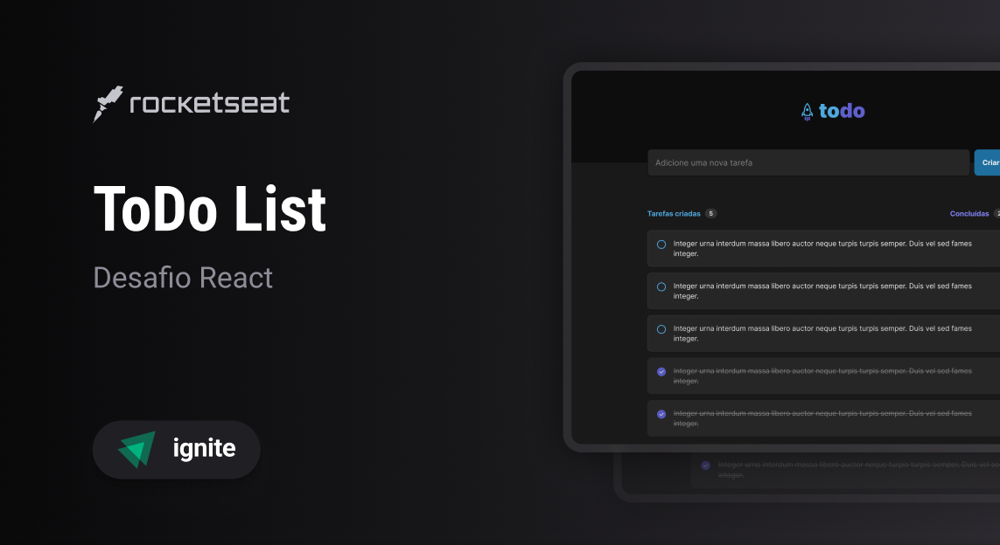

# React + TypeScript + Vite

## Desafio 01 To-Do List

ToDo List é uma página wev para criação e controler de tarefas.

Esse projeto é um dos desafios da trilha de React do Ignite

🛠️ Nesse projeto foi utilizado

- Vite
- CSS Modules
- Typescript
- Local Storage
